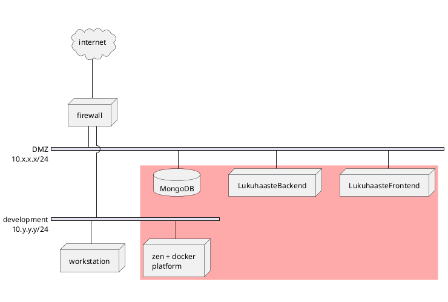
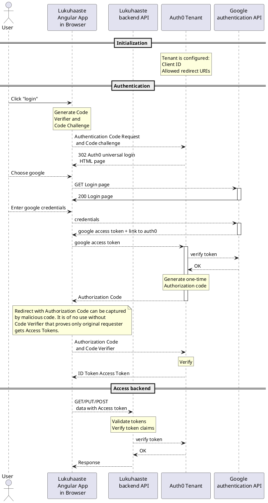
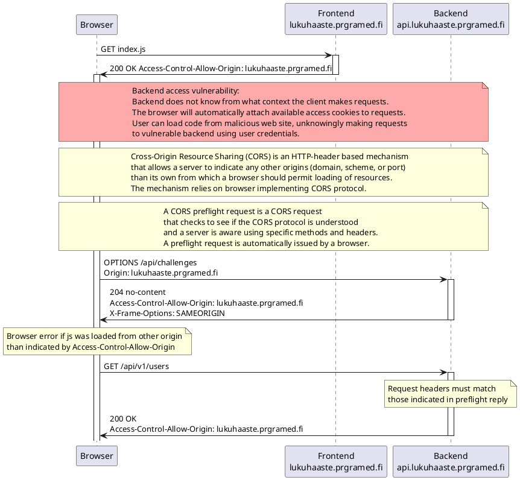

# Lukuhaaste

Author: JP Paalassalo \
Course:

## Introduction

The goal of this project is to demonstrate secure programming concepts in MEAN stack application. The application is a checklist tool for 50 preset reading challenges, and the user can record reading achievements for each challenge. The achievements are shared to other app users.

In the context of this course, the following work was done:

- top-level threat analysis for the app including networking and programs
- identifying and prioritizing threats
    - upgrading http to https for both frontend and backend
    - introducing user capabilities for frontend
    - implementing auth0 login and jwt sessions (frontend)
    - jwt token handling for backend
    - secure backend headers for backend including CORS

## Application architecture and deployment

The application consists of Angular single-page app frontend served by nginx, nodejs+express backend and Mongo database. These three are deployed in shared network, and firewall configuration allows external access to necessary frontend and backend ports. 


The selected architecture exposes database (and its admin access endpoint) unnecessarily to DMZ network. An alternative decision would be to place database to an internal network visible only to backend. The rationale for the selected architecture is that docker does not readily support connecting containers to multiple networks; it would be necessary to start the containers first and then attach the running backend container to other network. It would make system setup and maintenance more complex.

The database exposure vulnerability can be mitigated by limiting database access to backend and admin IP's only.

## Threat analysis

Threat analysis was implemented using a threat modelling process where all system components and interfaces were studied, attack vectors were identified and each vulnerability was scored as risk (0-5) based on damage x probability. 

| Scope | Vulnerability | Risk | Mitigation |
| ------ | ------ | ------ | ------ |
| firewall | configuration error | 2 | Utilize external testing services |
| firewall | unauthorized access | 2 | Keep FW updated. Strong admin password. Restrict access from internal network too. |
| frontend | nginx vulnerabilities | 4 | Set up watchtower to rebuild frontend as nginx upgrades are available. |
| docker platform | docker API vulnerabilities exposed to containers | 1 | Keep upgrading platform. All public containers must run with limited non-root privileges. |
| xen platform | virtualisation network stack has vulnerability  | 1 | Keep xen up-to-date. |
| backend/frontend node platform | node library vulnerabilities | 2 | Check and fix vulnerabilities using snyk. |
| development | Development workstation gets infected and provides admin access to system | 5 | Isolate development environment to a separate workstation or on Qubes OS. |
| frontend code | Frontend provides unauthorised access to backend | 1 | (Frontend code is public and fully modifiable by attackers; not much can be done) Implement user authentication and authorization. Sanitize data sent to backend. |
| frontend code | Frontend identity is compromised enabling MITM attack and possibly stealing user credentials | 2 | Use proper certificates and force using HTTPS, use external authentication. |
| frontend code | Lost user credentials allow stealing the account | 2 | Enable multi-factor authentication and anomaly detection |
| backend code | unauthorised access | 3 | Implement user authentication and jwt sessions |
| backend code | injection attacks | 3 | Sanitize all incoming data |
| backend code | CORS | 3 | Implement. Set SameSite cookie attribute to Strict. |

## Authentication and authorization

In order to achieve all required functionality and security authentication and authorization is inplemented using external service. Auth0 was selected. In Lukuhaaste use case, the recommended setup is "Authorization Code Flow with PKCE" where PKCE stands for "proof Key for Code Exchange". [https://auth0.com/docs/flows/authorization-code-flow-with-proof-key-for-code-exchange-pkce] [https://auth0.com/docs/libraries/auth0-angular-spa]



# Implementing authentication: frontend

The app uses auth0 SPA SDK library "@auth0/auth0-angular". The login component below provides minimal functionmality to bing a login button to auth0 library to start authentication process.

```javascript
import { Component, Inject } from '@angular/core';
import { AuthService } from '@auth0/auth0-angular';
import { DOCUMENT } from '@angular/common'; 

@Component({
  selector: 'app-login',
  templateUrl: './login.component.html',
  styleUrls: ['./login.component.css']
})
export class LoginComponent {

    // Inject the auth0 authentication service to document 
    constructor(@Inject(DOCUMENT) public document: Document, public auth: AuthService) {}
    // Provide login entry function for login button
    loginWithRedirect() {
      this.auth.loginWithRedirect();
    }
}
```

When a data service needs to access backend, the access token held by auth0 library needs to be inserted to http request headers. This is done by injecting the aythentication service to data service in its constructor. "getCurrentUserNick" function demonstrates how the gmail address of logged-in user (this.auth.user$) is mapped to user's app nickname (String userName).

```javascript
// User service provides user profile data based on
// app database values and auth0 authentication data.
// From auth0 data user email is used as key 
// to get user nick from app database.
// User nick is assumed to be unique and 
// is used to identify the user within the app.
// User nick is user settable and thus may 
// protect user's identity in other users' views.

@Injectable({
  providedIn: 'root'
})
export class UserService {
  userUrl:string = environment.apiUrl+'/api/users';

  //auth0 authentication service is injected here, and it will provide
  //access token to http requests 
  constructor(private http:HttpClient, public auth: AuthService) { }

  //get all users from database (with access token)
  getUsers():Observable<User[]> {
    return this.http.get<User[]>(this.userUrl);
  } 

  //get nick for authenticated user (or null)
  //need to join two observables to get result:
  //    1. array of users from database
  //    2. authenticated user from auth0 service
  getCurrentUserNick():Observable<String> {
    return this.getUsers().pipe(
      switchMap(users => this.auth.user$.pipe(
        map(authUser => users.find(user => user.email === authUser.email)),
        map(authUser => authUser.userName),
        take(1)
      ))
    )
  }
}
```

# Implementing authentication: backend

Thebackjend is implemented node express. Http request handlers can be added to handler stack as middleware. In the extract below, GET request for path /users/ will have to pass token validation "checkJwt" and token scope checking "jwtAuthz"; for GET operation requester needs read access for "users". Middleware error cases are handled at main level (index.js) where middleware stack is set up.

```javascript
const jwtAuthz = require('express-jwt-authz');
const checkScopes = jwtAuthz([ 'read:users' ]);

// gets all users, check access token!
router.get('/', checkJwt, checkScopes, (req, res) => {
    User.find({}).exec(function(err, docs) {
        if (!err) { 
            res.send(docs);
        }
        else {
            throw err;
        }
    });
});
```


# CORS



# Implementing backend headers including CORS

```javascript
// helmet sets most reply headers according to security best practises
app.use(helmet({
  contentSecurityPolicy :{
    directives:{
      defaultSrc:["'self'"]}
  }
 } ));

app.use(cors({ origin: clientOriginUrl }));
app.disable("x-powered-by");

let setCache = function (req, res, next) {
  if (req.method == 'GET') {
    res.set('Cache-control', `must-revalidate, no-cache, no-store`)
  } else {
    res.set('Cache-control', `must-revalidate, no-cache, no-store`)
  }
  next()
}

app.use(setCache)
// Body parser middleware
app.use(express.json());
app.use(express.urlencoded({ extended: false}));

const router = express.Router();
app.use('/api/users', require('./routes/api/users'));
app.use('/api/challenges', require('./routes/api/challenges'));
app.use('/api/books', require('./routes/api/books'));

app.use(function (req, res) {
  res.status(404);
  res.json({"message" : "Requested route does not exist" });
} );

//global error handler; if any of the functions in middleware stack throws exception it ends up here
app.use(function (err, req, res, next) {
  console.log("Error message" + err.name + ": " + err.message);
  if (err.name === 'UnauthorizedError') {
    res.status(401);
    res.json({"message" : err.name + ": " + err.message});
  } else { 
    res.status(500);
    res.json({"message" : err.name + ": " + err.message});
  } 
});
```

