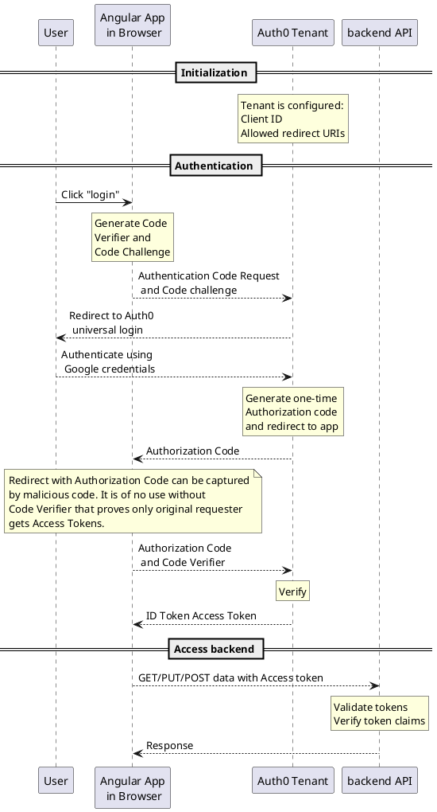

# Lukuhaaste

Author: JP Paalassalo \
Course:

## Introduction

The goal of this project is to demonstrate secure programming concepts in MEAN stack application. The application is a checklist tool for 50 preset reading challenges, and the user can record reading achievements for each challenge. The achievements are shared to other app users.

In the context of this course, the following work was done:

- top-level threat analysis for the app including networking and programs
- identifying and prioritizing threats
    - implementing https for both frontend and backend
    - introducing user capabilities for frontend
    - implementing auth0 login and jwt sessions (frontend)
    - jwt tokens for backend
- existing demo was deployed to public service

## Application architecture and deployment

The application consists of Angular single-page app frontend served by nginx, nodejs+express backend and Mongo database. These three are deployed in shared network, and firewall configuration allows external access to necessary frontend and backend ports. 

The selected architecture exposes database (and its admin access endpoint) unnecessarily to DMZ network. An alternative decision would be to place database to an internal network visible only to backend. The rationale for the selected architecture is that docker does not readily support connecting containers to multiple networks; it would be necessary to start the containers first and then attach the running backend container to other network. It would make system setup and maintenance more complex.

The database exposure vulnerability can be mitigated by limiting database access to backend and admin IP's only.

## Threat analysis

Threat analysis was implemented using a threat modelling process where all system components and interfaces were studied, attack vectors were identified and each vulnerability was scored as risk (0-5) based on damage x probability. 

| Scope | Vulnerability | Risk | Mitigation |
| ------ | ------ | ------ | ------ |
| firewall | configuration error | 2 | Utilize external testing services |
| firewall | unauthorized access | 2 | Keep FW updated. Strong admin password. Restrict access from internal network too. |
| frontend | nginx vulnerabilities | 4 | Set up watchtower to rebuild frontend as nginx upgrades are available. |
| docker platform | docker API vulnerabilities exposed to containers | 1 | Keep upgrading platform. All public containers must run with limited non-root privileges. |
| xen platform | virtualisation network stack has vulnerability  | 1 | Keep xen up-to-date. |
| backend/frontend node platform | node library vulnerabilities | 2 | Check and fix vulnerabilities using snyk. |
| development | Development workstation gets infected and provides admin access to system | 5 | Isolate development environment to a separate workstation or on Qubes OS. |
| frontend code | Frontend provides unauthorised access to backend | 1 | (Frontend code is public and fully modifiable by attackers; not much can be done) Implement user authentication and authorization. Sanitize data sent to backend. |
| frontend code | Frontend identity is compromised enabling MITM attack and possibly stealing user credentials | 2 | Use proper certificates and force using HTTPS, use external authentication. |
| frontend code | Lost user credentials allow stealing the account | 2 | Enable multi-factor authentication and anomaly detection |
| backend code | unauthorised access | 3 | Implement user authentication and jwt sessions |
| backend code | injection attacks | 3 | Sanitize all incoming data |
| backend code | CORS | 3 | Implement. Set SameSite cookie attribute to Strict. |

## Authentication and authorization

In order to achieve all required functionality and security authentication and authorization is inplemented using external service. Auth0 was selected. In Lukuhaaste use case, the recommended setup is "Authorization Code Flow with PKCE" where PKCE stands for "proof Key for Code Exchange". [https://auth0.com/docs/flows/authorization-code-flow-with-proof-key-for-code-exchange-pkce] [https://auth0.com/docs/libraries/auth0-angular-spa]

# ReadingChallenge

This project was generated with [Angular CLI](https://github.com/angular/angular-cli) version 11.2.0.

## Development server

Run `ng serve` for a dev server. Navigate to `http://localhost:4200/`. The app will automatically reload if you change any of the source files.

## Code scaffolding

Run `ng generate component component-name` to generate a new component. You can also use `ng generate directive|pipe|service|class|guard|interface|enum|module`.

## Build

Run `ng build` to build the project. The build artifacts will be stored in the `dist/` directory. Use the `--prod` flag for a production build.

## Running unit tests

Run `ng test` to execute the unit tests via [Karma](https://karma-runner.github.io).

## Running end-to-end tests

Run `ng e2e` to execute the end-to-end tests via [Protractor](http://www.protractortest.org/).

## Further help

To get more help on the Angular CLI use `ng help` or go check out the [Angular CLI Overview and Command Reference](https://angular.io/cli) page.
